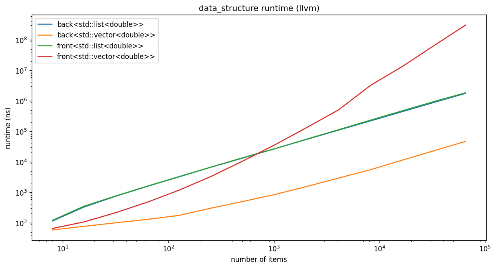
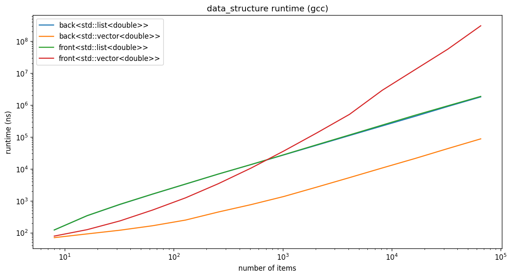
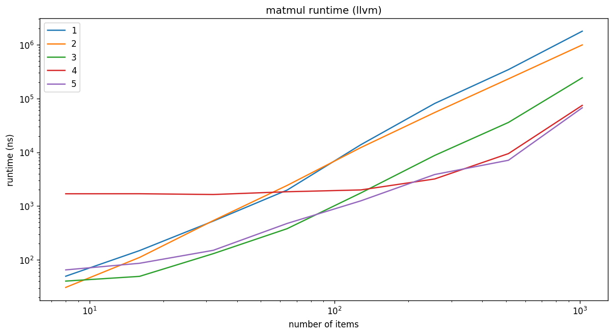
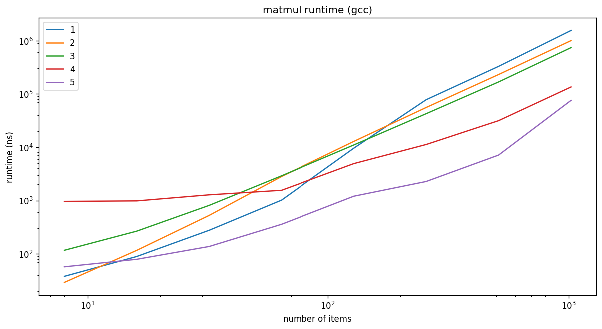
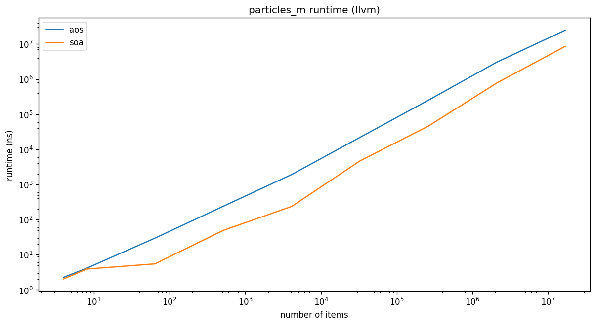
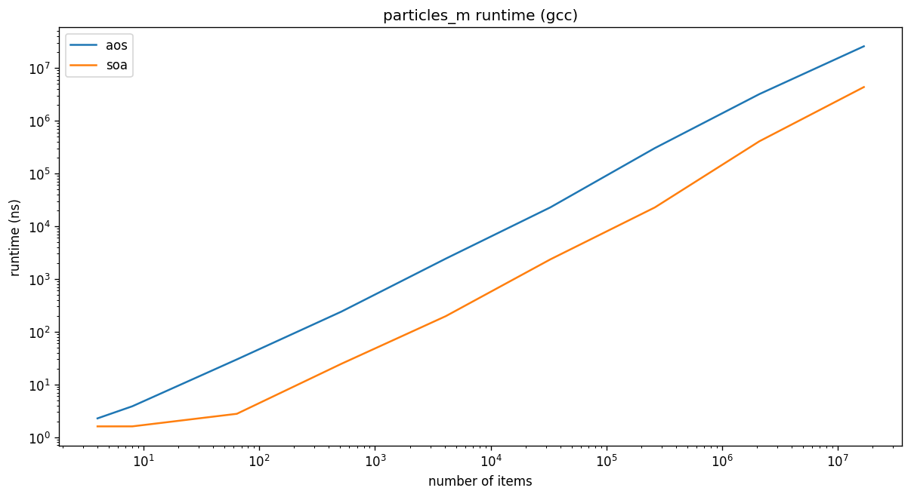
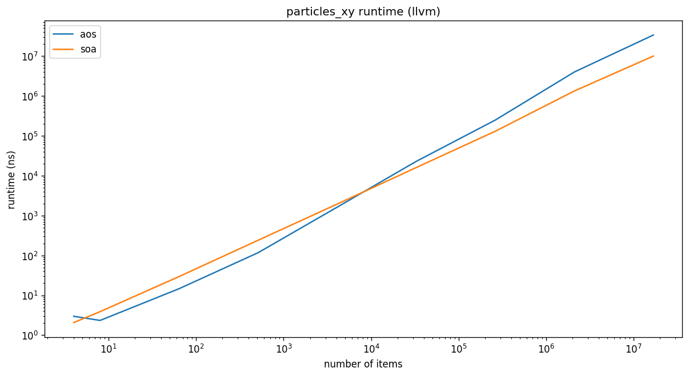
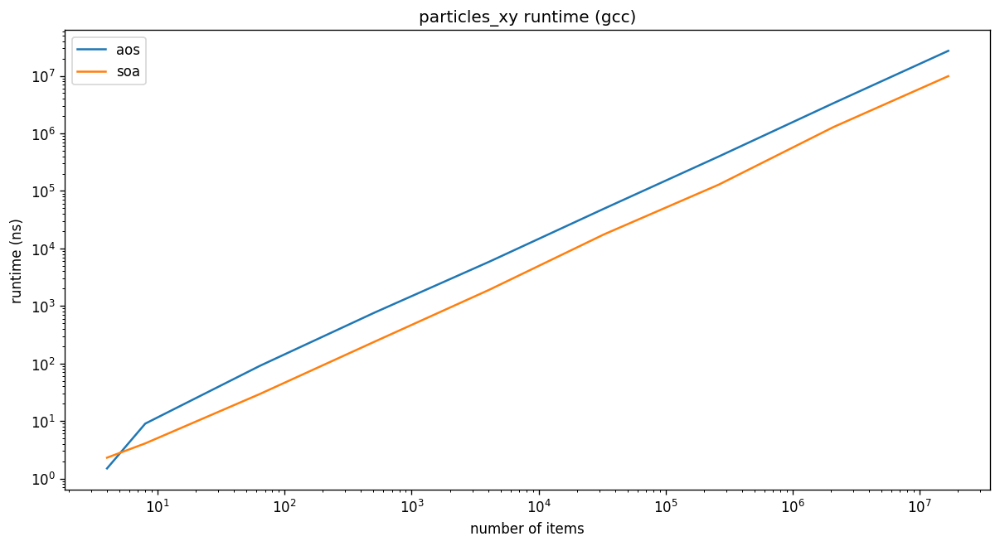

# High Performance C++

[](https://opensource.org/licenses/MIT)
[](https://github.com/ssciwr/high-performance-cpp/actions?query=workflow%3ACI)
[](https://codecov.io/gh/ssciwr/high-performance-cpp)

Sample code to accompany the SSC compact course High Performance C++

- [pdf slides](https://github.com/ssciwr/high-performance-cpp/raw/main/slides/slides.pdf)
- [pdf course description](https://ssc.iwr.uni-heidelberg.de/sites/default/files/high-performance-cpp-ss22.pdf)

## Getting started

To clone the repo, compile the code and run the benchmarks:

```
git clone --recursive https://github.com/ssciwr/high-performance-cpp.git
cd high-performance-cpp
mkdir build
cd build
cmake -DCMAKE_BUILD_TYPE=Release ..
cmake --build .
./bench/bench
```

## Plots

List versus Vector inserting elements:




Matrix-vector multiplication:




Struct of Arrays versus Array of Structs:






